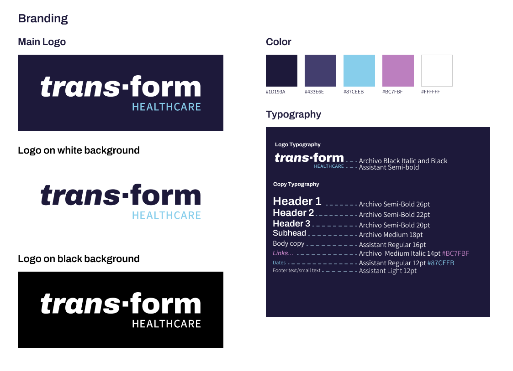
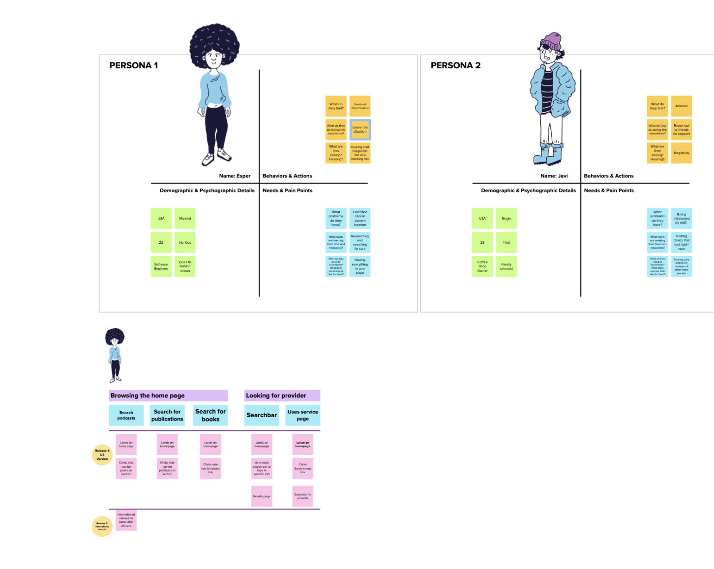
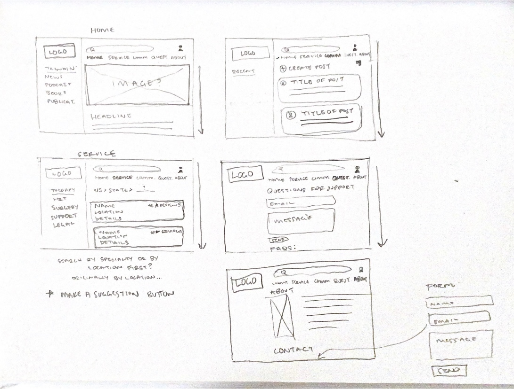
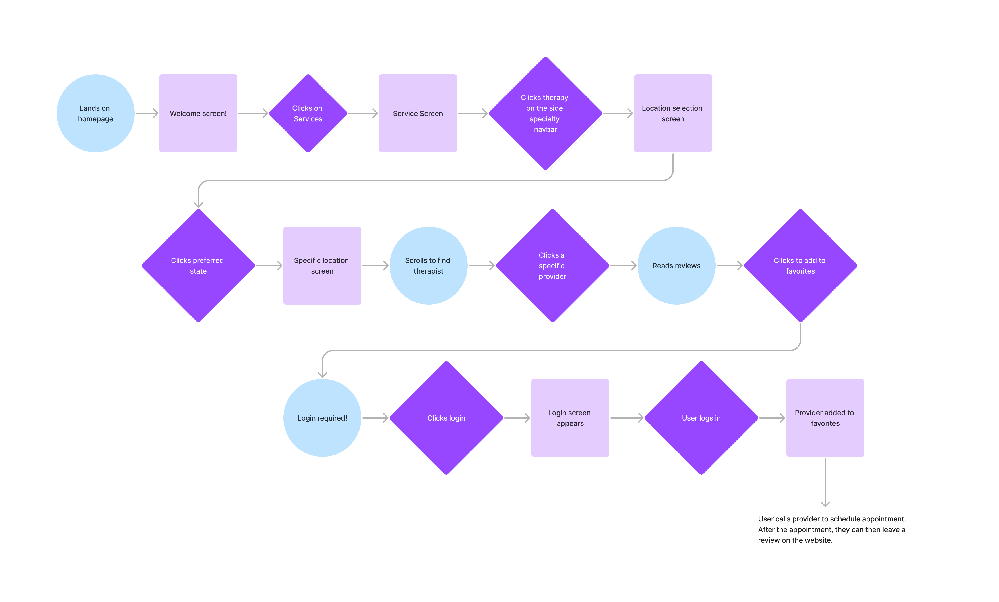
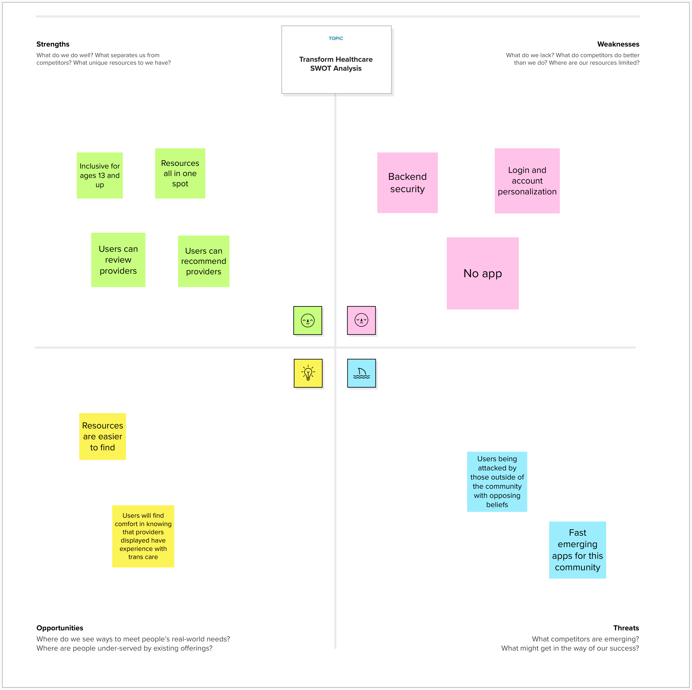

# Sam Woolson's Capstone

## Definition Statement
trans·form Healthcare acts as a resource for the trans community to find quality care based on the input of the community. All providers and services are gathered and reviewed by trans people themselves which helps others find care easily. This helps them avoid being mistreated by providers with biases or lack of knowledge of the care trans people need.

## Targeted Audience
The trans community ages ranging from 13 and up. Ages 17 and below will have restrictions of some content if necessary. Also depending on state laws.

## What is the purpose of my application?
To act as a resource and community support for those seeking healthcare information and care all.

## What business problem or real world problem am I going to be solving?
This would allows trans people to find valuable information and help curb the pain and overwhelming task of finding competent providers.
This would in hopes promote this audience find care and safety.

### What do I want on each page?
So far there will be 5 main pages.
Home, Service Directory, Community Forum, Question, and About (with contact at the bottom)

### What do I want the functionality of each page to be?
  1. Home: A place for users to see what's trending, news and updates, books, etc.

  2. Service Directory(this page name might change. TBD): Where users go to find providers based on location and service type such as therapy, hormone therapy, support groups, surgeons, and etc.

  3. Community Forum: Users can chat amongst themselves sharing experiences. Chat rules will apply here.

  4. Questions: Users go here to see any faqs or anything they'd like to ask such as name change on the platform and etc.

  5. About/Contact: A quick brief about projecy/company and a form for users to contact the company.

### Branding
The color palette chosen is based on the trans pride flag's blue, pink and white with a twist to make it more readabile for users. The dark blue background is to help those colors qpop but not too saturated. The color choice was strictly chosen for familiarity purposes to curb any uneasiness amongst users while they browse. The logo represents the strong need for healthcare to change expecially for trans people to feel safe and get competent care. I used a slab serif in combo with a thin sans serif font underneath to complement each other.
 

### Navigation

### Story Map

(https://app.mural.co/t/swoolson8758/m/swoolson8758/1679624931607/1d588240946d42e948865a1a4e35983442f650f4?sender=u07108d0f3243968c91b81598)

## Research
### Applications Researched: (links to websites / applications)
Competitors:
- Trevor Space by Trevor Project (https://www.trevorspace.org/?gclid=CjwKCAjw586hBhBrEiwAQYEnHSN0-oRVItgNbu-2p_kfSORT63admTS7VS_0V7rkJ8b-lBY4y61jvBoCv0YQAvD_BwE)
- Subreddits on Reddit (https://www.reddit.com/r/trans/)

List what you like about each site:
For both:
- Use of whitespace
- Navigation and easy to find information

List what you do not like about each site:
- Trevor Space - Lacking inclusiveness for all ages
- Reddit - Can get overwehlming when finding posts relative to needs

How my application will be different:
Users can do all their research in one place versus using multiple sources on the internet. This allows users to save time and find care tailored to their needs.

### Wireframes

### User Flow
Below you'll see a scenario for a user to add a provider to their favorites.

### SWOT Analysis

(https://app.mural.co/t/swoolson8758/m/swoolson8758/1681148369570/7c9d07210e42d8ad95fb678bc69e264c56f65a04?sender=u07108d0f3243968c91b81598)

